# FarmWise Database Entity Relationship Diagram

## ER Diagram (Mermaid)

```mermaid
erDiagram
    USER ||--o{ USERROLE : has
    USER ||--o{ FARM : owns
    USER ||--o{ FARMMEMBER : "is member of"
    USER ||--o{ FARMACTIVITY : performs
    USER ||--o{ EXPENSE : records
    USER ||--o{ SALE : records
    USER ||--o{ PRODUCTIONRECORD : records
    USER ||--o{ HARVEST : records
    USER ||--o{ AUDITLOG : "audited by"
    
    ROLE ||--o{ USERROLE : assigned_to
    ROLE ||--o{ ROLEPERMISSION : has
    PERMISSION ||--o{ ROLEPERMISSION : assigned_to
    
    FARM ||--o{ FARMMEMBER : "has members"
    FARM ||--o{ FIELD : contains
    FARM ||--o{ LIVESTOCK : contains
    FARM ||--o{ CROPCYCLE : "has cycles"
    FARM ||--o{ FARMACTIVITY : "has activities"
    FARM ||--o{ INPUT : contains
    FARM ||--o{ EXPENSE : records
    FARM ||--o{ SALE : records
    FARM ||--o{ PRODUCTIONRECORD : tracks
    FARM ||--o{ HARVEST : records
    FARM ||--o{ AUDITLOG : "has audit trail"
    FARM ||--o{ NOTIFICATION : "has notifications"
    
    FIELD ||--o{ CROPCYCLE : "has cycles"
    
    CROP ||--o{ CROPCYCLE : "grown in"
    CROPCYCLE ||--o{ EXPENSE : associated_with
    CROPCYCLE ||--o{ SALE : associated_with
    CROPCYCLE ||--o{ PRODUCTIONRECORD : tracks
    CROPCYCLE ||--o{ HARVEST : "yields"
    
    LIVESTOCKSPECIES ||--o{ LIVESTOCKBREED : "has breeds"
    LIVESTOCKSPECIES ||--o{ LIVESTOCK : contains
    LIVESTOCKBREED ||--o{ LIVESTOCK : "of breed"
    
    LIVESTOCK ||--o{ LIVESTOCKEVENT : "has events"
    LIVESTOCK ||--o{ HEALTHRECORD : "has records"
    LIVESTOCK ||--o{ FEEDINGRECORD : "has feeding"
    LIVESTOCK ||--o{ BREEDINGRECORD : "as female"
    LIVESTOCK ||--o{ BREEDINGRECORD : "as male"
    LIVESTOCK ||--o{ EXPENSE : associated_with
    LIVESTOCK ||--o{ SALE : associated_with
    LIVESTOCK ||--o{ PRODUCTIONRECORD : tracks
    
    MEDIAFILE ||--o{ FARMACTIVITY : "referenced by"
```



## Relationship Summary

### Core Authentication (5 entities)
- **User** → UserRole → Role → RolePermission → Permission
- Hierarchical access control with granular permissions

### Farm Organization (3 entities)
- **Farm** ← User (owner)
- **Farm** ← FarmMember (users with roles)
- **Farm** → Field (physical locations)

### Crop Management (2 entities)
- **Crop** → CropCycle (planning to harvest)
- **CropCycle** → Field (location)
- **CropCycle** ← Expense, Sale, ProductionRecord, Harvest

### Livestock Management (7 entities)
- **LivestockSpecies** → LivestockBreed → Livestock
- **Livestock** ← LivestockEvent (activity log)
- **Livestock** ← HealthRecord (medical records)
- **Livestock** ← FeedingRecord (feed management)
- **Livestock** ← BreedingRecord (mating/outcomes)

### Operations (2 entities)
- **FarmActivity** (general farm work)
- **Input** (seed, fertilizer, feed inventory)

### Financial Tracking (2 entities)
- **Expense** (costs for farm, crops, animals)
- **Sale** (revenue from crops or livestock)

### Production (2 entities)
- **ProductionRecord** (yield tracking)
- **Harvest** (specific harvest events)

### Audit & Compliance (3 entities)
- **AuditLog** (immutable audit trail)
- **Notification** (alerts, messages)
- **MediaFile** (images, documents)

## One-to-Many Relationships

| From | To | Meaning |
|------|-----|---------|
| User | Farm | User owns one or more farms |
| User | FarmMember | User is member of one or more farms |
| User | UserRole | User has one or more roles |
| User | FarmActivity | User performs one or more activities |
| User | Expense/Sale | User records one or more transactions |
| Role | UserRole | Role assigned to one or more users |
| Role | RolePermission | Role has one or more permissions |
| Permission | RolePermission | Permission assigned to one or more roles |
| Farm | Field | Farm has one or more fields |
| Farm | Livestock | Farm has one or more animals |
| Farm | CropCycle | Farm has one or more crop cycles |
| Farm | FarmActivity | Farm has one or more activities |
| Farm | Expense/Sale | Farm records one or more transactions |
| Farm | AuditLog | Farm has one or more audit entries |
| Field | CropCycle | Field has one or more crop cycles (over time) |
| Crop | CropCycle | Crop is used in one or more cycles |
| CropCycle | Expense/Sale/Harvest | Cycle associated with multiple records |
| LivestockSpecies | LivestockBreed | Species has one or more breeds |
| LivestockSpecies | Livestock | Species contains one or more animals |
| LivestockBreed | Livestock | Breed includes one or more animals |
| Livestock | LivestockEvent | Animal has one or more historical events |
| Livestock | HealthRecord | Animal has one or more health records |
| Livestock | FeedingRecord | Animal has one or more feeding records |
| Livestock | BreedingRecord | Animal (female) has one or more breeding records |
| Livestock | Expense/Sale | Animal associated with multiple transactions |

## Many-to-Many Relationships

| Table 1 | Junction | Table 2 | Meaning |
|---------|----------|---------|---------|
| User | UserRole | Role | Users have many roles; roles assigned to many users |
| Role | RolePermission | Permission | Roles have many permissions; permissions in many roles |
| User | FarmMember | Farm | Users belong to many farms; farms have many users |

## Key Cardinality Patterns

### Farm-Scoped Entities (Isolation)
These entities are scoped to a farm - each farm has separate instances:
- Field
- Livestock
- CropCycle
- FarmActivity
- Input
- Expense
- Sale
- ProductionRecord
- Harvest
- AuditLog
- Notification

### Global Entities (System-Wide)
These are defined once at system level:
- User
- Role
- Permission
- Crop
- LivestockSpecies
- LivestockBreed
- MediaFile

## Deletion Impact Analysis

### If User Deleted
- ❌ UserRole deleted (Cascade)
- ❌ FarmMember deleted (Cascade) - user removed from all farms
- ❌ FarmActivity deleted (Cascade) - their activities removed
- ✓ Owned farms? (RESTRICT in production) - prevents accidental farm deletion
- ✓ AuditLog entries preserved (RESTRICT)
- ✓ Expense/Sale records preserved (RESTRICT)

### If Farm Deleted
- ✓ All farm-scoped data deleted (Cascade): Fields, Livestock, CropCycles, Activities, Expenses, Sales, AuditLogs
- ❌ FarmMember entries deleted (Cascade)
- ⚠️ User not deleted (User → Farm is one-way)

### If Livestock Deleted
- ✓ All livestock-related data deleted (Cascade): Events, Health Records, Feeding Records
- ⚠️ Breeding records have maleId (if male deleted, SET NULL)
- ✓ AuditLog preserved (RESTRICT)
- ✓ Expense/Sale records preserved (RESTRICT - associations nulled)

### If CropCycle Deleted
- ✓ Expense/Sale/ProductionRecord associations nulled (SET NULL)
- ✓ Harvest deleted (Cascade) - cycles and harvests tightly coupled

### If CropCycle Status = COMPLETED
- ⚠️ No data deleted
- CropCycle preserved for historical records
- Can't be edited (business logic)
- Can still query related expenses, sales, harvests

## Temporal Data Patterns

### Event Timestamping
```
LivestockEvent:
  - eventDate: 2025-01-15 (when the vaccination happened)
  - recordedAt: 2025-01-17 (when farmer entered it in system)
  - createdAt: 2025-01-17T14:30:00Z (database insertion)
```

### Activity Timestamping
```
FarmActivity:
  - activityDate: 2025-02-01 (day activity occurred)
  - activityTime: 2025-02-01T09:30:00Z (specific time, optional)
  - createdAt: 2025-02-01T14:15:00Z (when recorded in system)
  - updatedAt: 2025-02-05T10:00:00Z (last modification)
```

### Record Timestamping
```
Expense/Sale/Harvest:
  - expenseDate/saleDate/harvestDate: 2025-01-15 (when event occurred)
  - createdAt: 2025-01-17T14:30:00Z (when recorded)
  - updatedAt: 2025-01-20T09:00:00Z (if corrected)
```

## Extensibility Points

### Add New Crop Type
Simply insert new row into Crop table - existing CropCycles automatically compatible

### Add New Livestock Species
Simply insert new row into LivestockSpecies table - existing Livestock can reference it

### Add New Role
Simply insert new row into Role table - assign permissions via RolePermission

### Add New Permission
Simply insert new row into Permission table - assign to roles via RolePermission

### Add New Activity Type
Add to ActivityCategory enum and redeploy - or use INPUT in expense without category

### Add New Input Type
Add to InputCategory enum and redeploy - allows new input types without schema change

## Data Quality Constraints

### Enforced by Database
- Email uniqueness (User.email)
- Phone uniqueness (User.phone)
- Farm uniqueness per user-farm pair (FarmMember)
- Animal tag uniqueness per farm (Livestock)
- Role/Permission uniqueness
- Breed uniqueness per species

### Enforced by Application
- Farm membership verification (user can only access own farms)
- Field must belong to farm before creating cycle
- Crop must exist before creating cycle
- Animal species must exist before adding livestock
- RecordedBy user must exist

### Soft Constraints (Business Logic)
- CropCycle status transitions (PLANNING → PREPARED → PLANTED → GROWING → HARVESTING → COMPLETED)
- Can't delete completed crop cycles (business logic soft delete)
- Can't update historical audit logs
- Soft delete (deletedAt) not implemented in schema but can be added at app level

## Performance Considerations

All indexes are designed for:
1. Farm-scoped filtering (most common query pattern)
2. Date-range queries (reports and analytics)
3. Status filtering (active records)
4. User-based filtering (my activities/transactions)

See [DATABASE_ARCHITECTURE.md](./DATABASE_ARCHITECTURE.md#indexes-for-performance) for complete index strategy.
